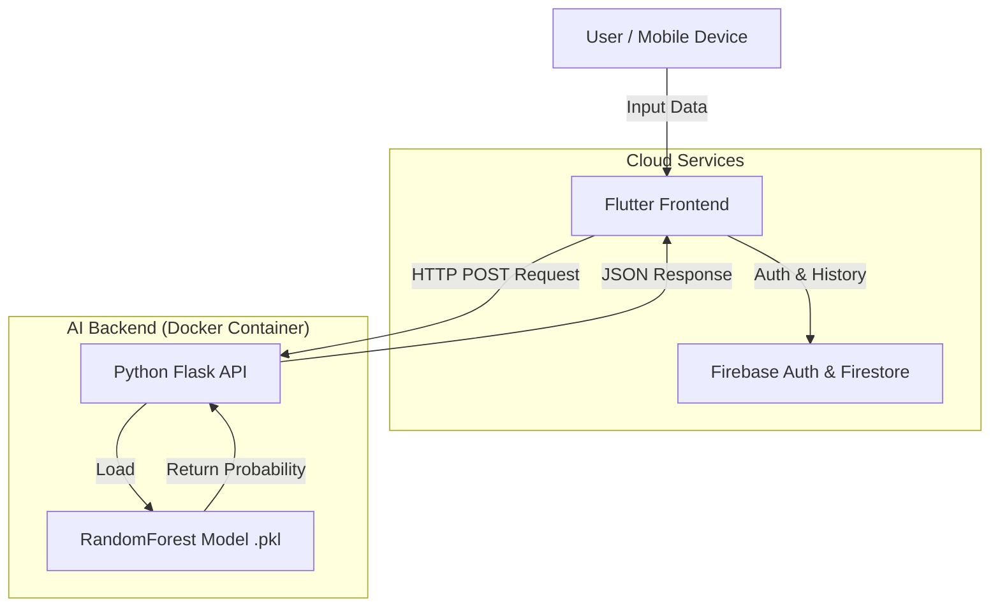

# GlucoGuard - Diabetes Risk Prediction System

**GlucoGuard** is an interdisciplinary mobile health application designed to predict the risk of diabetes in patients using Machine Learning. It features a cross-platform mobile interface (Flutter), a secure cloud database (Firebase), and an AI-powered backend (Python/Flask).

---

## System Architecture

The system follows a modern client-server architecture with offline capabilities.



## Services & Tech Stack

### 1. Frontend (Mobile App)
* **Framework:** Flutter (Dart)
* **Features:** User Authentication, Dynamic Forms, Real-time Risk Visualization (Gauge Chart), History Logs.
* **Offline Mode:** Uses local fallback logic when the backend is unreachable.

### 2. Backend (AI Service)
* **Language:** Python 3.10+
* **Framework:** Flask
* **Model:** Scikit-Learn (Random Forest Classifier).
* **Dataset:** Pima Indians Diabetes Database (Re-trained for feature consistency).
* **Deployment:** Docker Container.

### 3. Database & Auth
* **Service:** Google Firebase.
* **Authentication:** Email/Password via Firebase Auth.
* **Database:** Cloud Firestore (Stores user profiles and prediction history).

---

## API Documentation

The backend exposes a single RESTful endpoint for predictions.

### **POST** `/predict`

Calculates the diabetes risk probability based on physiological inputs.

**Request Body (JSON):**
```json
{
  "glucose": 120.0,
  "bmi": 24.5,
  "age": 35.0,
  "systolic": 110.0,
  "diastolic": 75.0,
  "insulin": 80.0,
  "skinThickness": 20.0,
  "gender": 1.0  
}
```

**Response (JSON):**
```json
{
  "risk": "Low Risk (Non-Diabetic)",
  "probability": 0.12,
  "timestamp": "2025-11-23T14:30:00.000000"
}
```


## Installation & Setup Scripts

Follow these steps to run the project locally.

### Prerequisites
* Flutter SDK
* Python 3.10 or higher
* Docker Desktop (Optional, for containerization)

### Step 1: Backend Setup
1.  Navigate to the project root.
2.  Install Python dependencies:
    ```bash
    pip install flask pandas scikit-learn joblib
    ```
3.  **Train the AI Model** (Generates `diabetes_model.pkl`):
    ```bash
    python train_model.py
    ```
4.  **Run the Server:**
    ```bash
    python backend.py
    ```
    *Server will start on `http://0.0.0.0:5000`*

### Step 2: Frontend Setup
1.  Open a new terminal.
2.  Install Flutter packages:
    ```bash
    flutter pub get
    ```
3.  Run the app (Select Android Emulator or Chrome):
    ```bash
    flutter run
    ```

---

## Docker Deployment

To deploy the backend as a container:

1.  **Build the Image:**
    ```bash
    docker build -t glucoguard-backend .
    ```

2.  **Run the Container:**
    ```bash
    docker run -p 5000:5000 glucoguard-backend
    ```

---

## Testing

### Unit Tests
The project includes unit tests for the critical AI logic.

**Run Backend Tests:**
```bash
python test_backend.py
```


## Contributors
* PETRE Teodora-Maria
* NEDELCU-HOLTEA Cătălina
* FLOREA Ioana-Ana-Maria